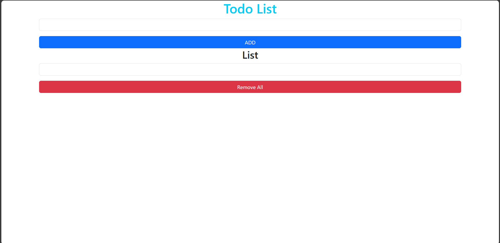

# TodoList App

TodoList is a task management app that helps users organize and track daily tasks easily and efficiently.

## Screenshot

## Features

- Add, delete, and update tasks
- Manage tasks by day and week
- User-friendly interface

## Installation

1. Clone the repo: git clone `https://github.com/Khanhlinh0209/TodoList.git`
2. Install dependencies: `npm install`
3. Run the application: `npm start`

## Technologies

- **Frontend:** HTML5, CSS, Bootstrap, JavaScript

## Future Development

- Integrate task reminder feature
- Develop an API for the application

## Author

Khanhlinh0209
